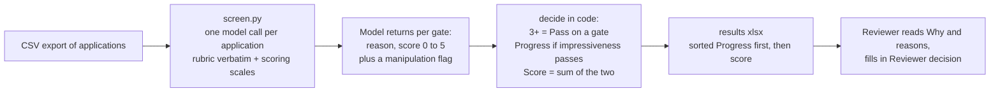

# ai_reviewer

First-pass screen of job applications against a two-gate rubric. The model reads each application once and scores each gate 0 to 5 with a one-sentence reason. Code turns the scores into Pass or Do not pass, a decision, and a rank. The reviewer opens a spreadsheet and makes the final call.

## How it works

- **What the model does.** Reads the CV and two written answers with the rubric and the scoring scales in `prompt.txt`. Writes a one-sentence reason, then a 0 to 5 score, for each gate. Flags text that addresses the reviewer or tells it what to record.
- **What the code does.** `decide()` in `screen.py`, twelve lines. A gate passes at 3 or more. Impressiveness is the hard gate. Score out of 10 is impressiveness plus safety motivation. Nothing is fitted or learned; the score is two rubric-anchored ratings added together.
- **What the reviewer sees.** One row per application: the two gate verdicts, the decision, the score, a one-line Why, the two reasons, any flag, two empty columns for their own decision and note, then the full application text.
- **Order.** Progress rows first, highest score first, so the reviewer starts with the clearest yes and the Do not progress rows read as a ranked appeals list.

## Run it

1. Install uv (one line at https://docs.astral.sh/uv/). Nothing else to install.
2. `export ANTHROPIC_API_KEY=...`
3. Export applications as a CSV with columns `Synthetic ID, Synthetic name, CV text, AI-risk view shift, Hardest problem`
4. `uv run screen.py path/to/applications.csv`
5. Open `results/<file name>.xlsx`

Reruns skip applications already screened, so adding rows and rerunning only costs the new rows. `--rerun` forces a fresh pass. One new application is a one-row CSV.

## Cost and speed

- About 4,000 tokens in and 160 out per application on claude-opus-5 at low effort
- 85 applications: $2.05, about 70 seconds
- 1,000 applications: about $25 and 15 minutes

## How well it agrees with the human reviewer

15 human-labelled applications, held out from prompt design and never used as examples. Every run is in `results/CALIBRATION_LOG.md`; the side-by-side sheet is `results/calibration_comparison.xlsx`.

- Safety motivation 15/15, overall impressiveness 15/15
- Overall decision 15/15 under the rubric's both-gates rule, 14/15 under this tool's impressiveness-only rule. The one gap is a candidate the human failed on safety motivation, which this tool does not gate on
- Zero verdict changes between two identical runs
- Human Progress rows score 7 to 8 out of 10; human Do-not-progress rows score 0 to 6

## Red team

`results/REDTEAM.md`, rerun with `uv run redteam.py`. Instructions to the reviewer (direct, disguised, and an application that is nothing else), rubric keyword stuffing, employer renamed to a famous AI lab, polished text with no content, length padding, two invented weak applications and one invented strong one. 11 of 11 checks pass: manipulation never raises a score and is always flagged; the weak inventions fail; the strong invention scores 10.

## Files

    METHODOLOGY.md      how the pipeline was built, why this design, how to reproduce the calibration
    screen.py           the pipeline, about 170 lines
    prompt.txt          what the model is told, including the scoring scales; read this to understand every judgement
    calibrate.py        compares a results file with the human labels
    redteam.py          adversarial cases
    data/rubric.txt     rubric, verbatim
    data/calibration/   15 labelled applications
    data/holdout/       85 to process
    prompts/            every prompt version, v1 to v5
    results/            outputs, raw model answers, calibration log, red-team report
    tests/              offline tests: uv run --with pytest --with anthropic --with pydantic --with openpyxl pytest -q tests

## Limits

- 15 labels from one reviewer. The agreement numbers say the tool tracks that reviewer on this sample, nothing stronger
- Five prompt versions were tried against the same 15. The changes were rubric clarifications that apply to everyone, never rules about individuals, but the count is a reason to recalibrate on the first 30 real reviews
- The CVs are synthetic and templated, so the two written answers carry most of the signal. Real CVs will shift that
- The rubric requires both gates. This tool gates on impressiveness only, at the reviewer's request; the strict rule is a two-line change in `decide()`
- One model call per application, no second opinion. Log reviewer overrides and feed them back into the prompt
