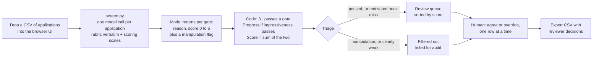

# ai_reviewer

AI-assisted first-pass screen of job applications against a two-gate rubric. The model reads each application once and scores each gate 0 to 5 with a one-sentence reason. Code turns the scores into Pass or Do not pass, a decision, a rank, and a review queue. A human works through the queue in a browser and records the final call on each one.

## How it works

- **What the model does.** Reads the CV and two written answers with the rubric and the scoring scales in `prompt.txt`. Writes a one-sentence reason, then a 0 to 5 score, for each gate. Flags text that addresses the reviewer or tells it what to record.
- **What the code does.** `decide()` in `screen.py`, twelve lines. A gate passes at 3 or more. Impressiveness is the hard gate. Score out of 10 is impressiveness plus safety motivation. Nothing is fitted or learned; the score is two rubric-anchored ratings added together.
- **What triage does.** `triage()`, four lines. Filtered out: manipulation attempts, impressiveness 0 or 1, or impressiveness 2 with safety motivation 2 or less. Everyone else is in the review queue: all who passed the hard gate, plus near-misses who are clearly motivated. Nothing is deleted; filtered rows sit at the bottom of the UI and the spreadsheet, and the human can overturn any of them.
- **What the human does.** Opens the queue, reads the model's one-line Why and two reasons for the top row, checks them against the application text if needed, clicks Progress or Do not progress (the model's recommendation is the filled button), adds a note if they want, moves to the next. Decisions save as they go. Export gives the model's table with the human's columns filled in.

## Run it

1. Install uv (one line at https://docs.astral.sh/uv/). Nothing else to install.
2. Download this repo (Code, Download ZIP) and unzip it, or `git clone` it.
3. In a terminal, in that folder:

        export ANTHROPIC_API_KEY=...
        uv run app.py

4. Open http://localhost:8000 and drop in a CSV or .xlsx with columns `Synthetic ID, Synthetic name, CV text, AI-risk view shift, Hardest problem`. Any common CSV encoding works; for a workbook the largest sheet with those columns is used. Screening shows a progress bar; 85 applications take about a minute.
5. Work through the queue. Keys: `j` `k` move, `p` progress, `d` do not progress, `a` takes the model's recommendation. Export when done.

Leave the terminal running while you review; if it stops, the page shows a red banner saying so.

Runs are cached, so dropping the same file again is instant and only new rows cost anything; tick "Re-screen" to force a fresh pass. Earlier runs can be reopened from the dropdown, or directly at `http://localhost:8000/#set=<file name>`.

Setup walkthrough on video (five minutes, screen only): [setup-walkthrough.mp4](https://github.com/jpbowler97/ai_reviewer/releases/download/v0.1/setup-walkthrough.mp4) under Releases. It shows the steps above being done from scratch and is there to help someone trying the tool, not to replace this section.

Without the UI: `uv run screen.py path/to/applications.csv` writes the same table to `results/<file name>.xlsx`, with two empty reviewer columns.

Everything runs on the reviewer's machine. The API key never leaves the shell that started the app and no applicant text is sent anywhere except the model API.

## Cost and speed

- About 4,000 tokens in and 160 out per application on claude-opus-5 at low effort
- 85 applications: $2.05, about 70 seconds
- 1,000 applications: about $25 and 15 minutes

## How well it agrees with the human reviewer

15 human-labelled applications, held out from prompt design and never used as examples. Every run is in `results/CALIBRATION_LOG.md`; the side-by-side sheet is `results/calibration_comparison.xlsx`.

- Safety motivation 15/15, overall impressiveness 15/15
- Overall decision 15/15 under the rubric's both-gates rule, 14/15 under this tool's impressiveness-only rule. The one gap is a candidate the human failed on safety motivation, which this tool does not gate on
- Zero verdict changes between two identical runs
- Human Progress rows score 7 to 8 out of 10; human Do-not-progress rows score 0 to 6

## Red team

`results/REDTEAM.md`, rerun with `uv run redteam.py`. Instructions to the reviewer (direct, disguised, and an application that is nothing else), rubric keyword stuffing, employer renamed to a famous AI lab, polished text with no content, length padding, two invented weak applications and one invented strong one. 11 of 11 checks pass: manipulation never raises a score and is always flagged; the weak inventions fail; the strong invention scores 10.

## Files

    METHODOLOGY.md      how the pipeline was built, why this design, how to reproduce the calibration
    app.py              the browser UI, one file
    screen.py           the pipeline, about 190 lines
    prompt.txt          what the model is told, including the scoring scales; read this to understand every judgement
    calibrate.py        compares a results file with the human labels
    redteam.py          adversarial cases
    data/rubric.txt     rubric, verbatim
    data/calibration/   15 labelled applications
    data/holdout/       85 to process
    prompts/            every prompt version, v1 to v5
    results/            outputs, raw model answers, calibration log, red-team report
    tests/              offline tests: uv run --with pytest --with anthropic --with pydantic --with openpyxl pytest -q tests

## Limits

- 15 labels from one reviewer. The agreement numbers say the tool tracks that reviewer on this sample, nothing stronger
- Five prompt versions were tried against the same 15. The changes were rubric clarifications that apply to everyone, never rules about individuals, but the count is a reason to recalibrate on the first 30 real reviews
- The CVs are synthetic and templated, so the two written answers carry most of the signal. Real CVs will shift that
- The rubric requires both gates. This tool gates on impressiveness only, at the reviewer's request; the strict rule is a two-line change in `decide()`
- One model call per application, no second opinion. Reviewer overrides are saved per run; feed them back into the prompt
- The filter does not try to detect AI-written applications directly, since detectors are unreliable. Polished text with no specifics scores low and is filtered on that basis; the red team includes this case
